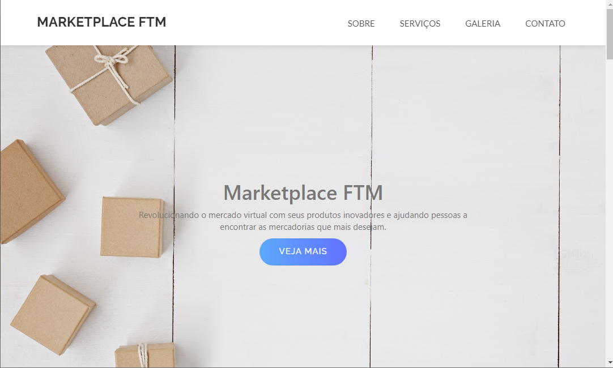
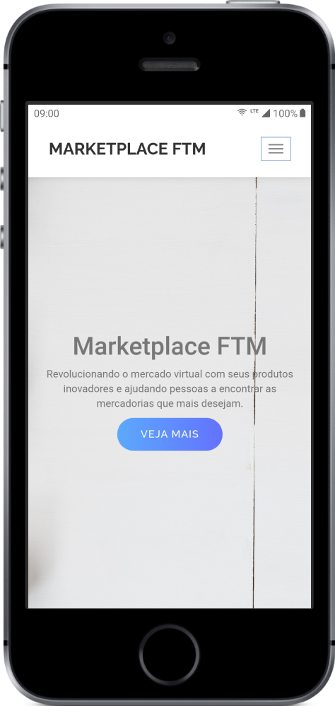
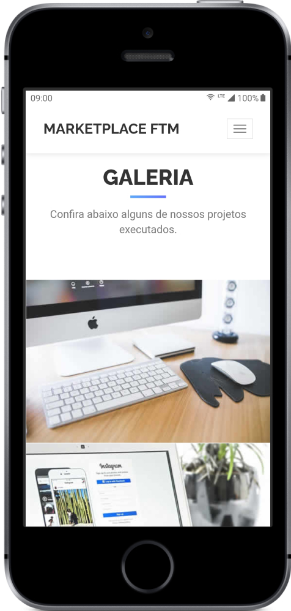
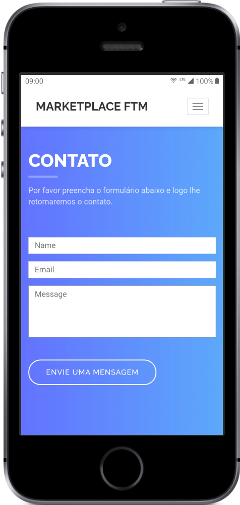

## About the project

This is a website project developed for Marketplace FTM. It was developed mainly with ReactJS and Next.js. Plus Bootstrap to make it responsive. This is a private project.

#### Link in production: [https://market-ftm.vercel.app](https://market-ftm.vercel.app/)

## 💡 The application

    

    
    
    
    
    

