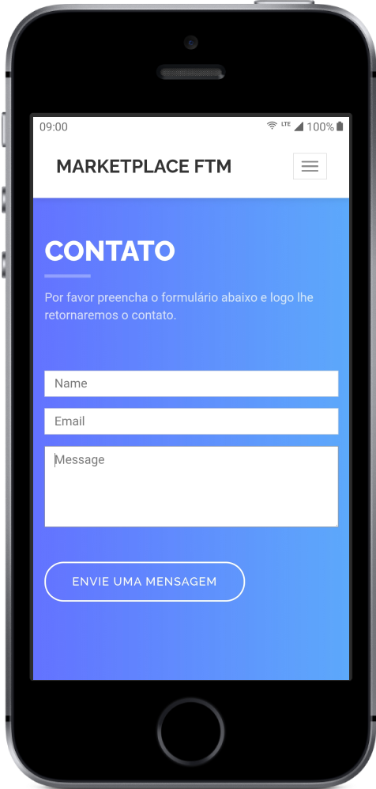

## 💻 About the project

This is a website project developed for Marketplace FTM. It was developed mainly with ReactJS and Next.js. Plus Bootstrap to make it responsive. This is a private project.

#### Available at: [https://market-ftm.vercel.app](https://market-ftm.vercel.app/)

## 🛠 Technologies and concepts
- [ReactJS][reactjs]
- [Next.js][nextjs]
- [TypeScript][typescript]
- [Vercel][vercel]
- [Node.js][nodejs]

## 💡 The application

    

    
    
    
    
    

## 📝 License

This applicaton belongs to Marketplace FTM.

Developed by Vagner Vengue. ([LinkedIn])

For more information, please feel free to contact me.

[LinkedIn]: https://br.linkedin.com/in/vagner-vengue
[reactjs]: https://reactjs.org
[nextjs]: https://nextjs.org
[typescript]: https://www.typescriptlang.org/
[Vercel]: https://vercel.com/
[nodejs]: https://nodejs.org/
